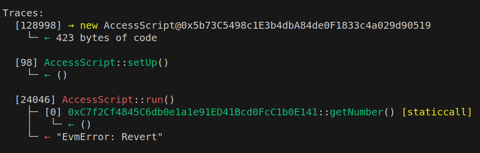

# Foundry Forge Scripts

## Open anvil local node (with blocktime)

```bash
anvil --block-time 10
```

## Deploy the contract by script and access state

You may first execute the script:

```bash
forge script script/Counter.s.sol --fork-url http://localhost:8545 --broadcast --private-key 0xac0974bec39a17e36ba4a6b4d238ff944bacb478cbed5efcae784d7bf4f2ff80
```

The above command will display the deploy address of `Counter contract`, as the below:

```bash
== Logs ==
Counter Address | 0xC7f2Cf4845C6db0e1a1e91ED41Bcd0FcC1b0E141
[Block x] | After 1st increment, number is 1
```

After 5 seconds, you may execute the `Access` script:

```bash
forge script script/Access.s.sol  --fork-url  http://localhost:8545 --broadcast --private-key 0xac0974bec39a17e36ba4a6b4d238ff944bacb478cbed5efcae784d7bf4f2ff80
```

## Expected

The `Access` script will display the state of `Counter contract`, as the below:

```bash
== Logs ==
[Block x] | After 2nd increment, number is 2
```

## Actual

However, I cannot access the `Counter` contract I deployed before, which will cause an `EvmError: Revert`

